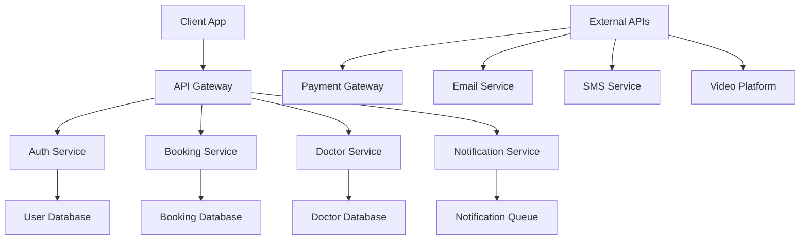

# MediConnect Implementation Plan

## Phase 1: Core Platform Enhancement (Weeks 1-4)

### Week 1: Backend Foundation
**Goal**: Replace JSON storage with real database and API
- [ ] Set up Node.js/Express backend server
- [ ] Implement MongoDB/PostgreSQL database
- [ ] Create RESTful API endpoints for:
  - [`/api/doctors`](main.js:1) - Doctor management
  - [`/api/slots`](main.js:1) - Time slot management  
  - [`/api/bookings`](main.js:1) - Appointment handling
- [ ] Add data validation and error handling
- [ ] Implement basic authentication middleware

### Week 2: User Authentication & Profiles
**Goal**: Add user accounts and personalization
- [ ] Implement JWT-based authentication system
- [ ] Create patient registration and login forms
- [ ] Build patient profile management
- [ ] Add appointment history tracking
- [ ] Implement user preferences and settings

### Week 3: Enhanced Search & Booking
**Goal**: Improve core user experience
- [ ] Add geolocation-based doctor recommendations
- [ ] Implement real-time availability updates
- [ ] Enhance search with insurance provider filtering
- [ ] Add urgent care/emergency appointment features
- [ ] Implement appointment reminder system

### Week 4: Admin & Management Tools
**Goal**: Strengthen administrative capabilities
- [ ] Build real-time appointment notifications
- [ ] Add bulk slot management features
- [ ] Implement advanced analytics and reporting
- [ ] Create doctor onboarding workflow
- [ ] Add clinic settings and configuration

## Phase 2: Advanced Features (Weeks 5-8)

### Week 5: Communication System
**Goal**: Enable patient-doctor communication
- [ ] Implement email/SMS appointment reminders
- [ ] Add prescription management system
- [ ] Create patient messaging portal
- [ ] Build notification preferences
- [ ] Add automated follow-up system

### Week 6: Health Records Integration
**Goal**: Add medical record capabilities
- [ ] Create patient health profile
- [ ] Implement prescription history
- [ ] Add medical document upload/management
- [ ] Build allergy and medication tracking
- [ ] Create health summary dashboard

### Week 7: Video Consultation
**Goal**: Enable virtual healthcare
- [ ] Integrate WebRTC for video calls
- [ ] Build virtual waiting room
- [ ] Add screen sharing capabilities
- [ ] Implement call recording (with consent)
- [ ] Create virtual prescription system

### Week 8: Mobile Optimization
**Goal**: Enhance mobile experience
- [ ] Create Progressive Web App (PWA)
- [ ] Implement offline functionality
- [ ] Add push notifications
- [ ] Optimize for mobile performance
- [ ] Create mobile-specific UX improvements

## Phase 3: Scaling & Enterprise Features (Weeks 9-12)

### Week 9: Multi-Clinic Support
**Goal**: Enable platform expansion
- [ ] Implement clinic management system
- [ ] Add multi-location booking
- [ ] Create clinic-specific settings
- [ ] Build referral system between clinics
- [ ] Add regional availability management

### Week 10: Payment Integration
**Goal**: Add financial capabilities
- [ ] Integrate payment gateway (Stripe/PayPal)
- [ ] Implement insurance verification
- [ ] Add billing and invoicing system
- [ ] Create payment history and receipts
- [ ] Build refund and cancellation policies

### Week 11: Advanced Analytics
**Goal**: Enhance data insights
- [ ] Implement comprehensive analytics dashboard
- [ ] Add predictive booking trends
- [ ] Create patient satisfaction metrics
- [ ] Build revenue and performance reports
- [ ] Add custom reporting tools

### Week 12: Security & Compliance
**Goal**: Ensure enterprise readiness
- [ ] Implement HIPAA compliance measures
- [ ] Add advanced security protocols
- [ ] Create audit logging system
- [ ] Build data backup and recovery
- [ ] Implement role-based access control

## Technical Implementation Details

### Backend Architecture


### Database Schema Enhancements
```sql
-- Users table
CREATE TABLE users (
    id UUID PRIMARY KEY,
    email VARCHAR(255) UNIQUE,
    password_hash VARCHAR(255),
    role VARCHAR(50), -- patient, doctor, admin
    profile_data JSONB,
    created_at TIMESTAMP
);

-- Appointments with enhanced fields
CREATE TABLE appointments (
    id UUID PRIMARY KEY,
    patient_id UUID REFERENCES users(id),
    doctor_id UUID REFERENCES users(id),
    slot_id UUID REFERENCES time_slots(id),
    status VARCHAR(50), -- confirmed, pending, cancelled
    reason TEXT,
    notes TEXT,
    created_at TIMESTAMP
);

-- Time slots with availability
CREATE TABLE time_slots (
    id UUID PRIMARY KEY,
    doctor_id UUID REFERENCES users(id),
    start_time TIMESTAMP,
    end_time TIMESTAMP,
    available BOOLEAN,
    appointment_type VARCHAR(50) -- in-person, virtual
);
```

### API Endpoints to Implement
```javascript
// Authentication
POST /api/auth/register
POST /api/auth/login
POST /api/auth/refresh
POST /api/auth/logout

// User Management
GET /api/users/profile
PUT /api/users/profile
GET /api/users/appointments
GET /api/users/prescriptions

// Booking System
GET /api/doctors?specialty=cardiology&location=ny
GET /api/doctors/:id/availability
POST /api/appointments
PUT /api/appointments/:id/cancel
GET /api/appointments/:id

// Admin Features
GET /api/admin/dashboard
GET /api/admin/appointments
POST /api/admin/slots/bulk
GET /api/admin/analytics
```

## Migration Strategy

### Step 1: Data Migration
- [ ] Create migration scripts for existing JSON data
- [ ] Validate data integrity after migration
- [ ] Implement data backup procedures

### Step 2: API Integration
- [ ] Create API client in existing frontend
- [ ] Implement gradual migration from localStorage
- [ ] Add fallback mechanisms for API failures

### Step 3: Feature Rollout
- [ ] Deploy backend infrastructure
- [ ] Migrate user data progressively
- [ ] Enable new features with feature flags
- [ ] Monitor performance and user feedback

## Success Metrics

### Key Performance Indicators
- **Booking Conversion Rate**: Target > 25%
- **User Registration**: Target 1,000+ monthly
- **Appointment Completion**: Target > 90%
- **Patient Satisfaction**: Target 4.5+ rating
- **System Uptime**: Target 99.9%

### Technical Metrics
- **Page Load Time**: < 2 seconds
- **API Response Time**: < 200ms
- **Mobile Performance Score**: > 90
- **Security Audit Score**: > 95%

## Risk Mitigation

### Technical Risks
- **Data Loss**: Implement comprehensive backup strategy
- **Performance Issues**: Use caching and CDN distribution
- **Security Breaches**: Regular security audits and monitoring

### Business Risks
- **User Adoption**: Gradual feature rollout with user education
- **Regulatory Compliance**: HIPAA compliance from day one
- **Competition**: Focus on superior user experience and reliability

## Resource Requirements

### Development Team
- **Backend Developer**: 2 (Node.js, Database)
- **Frontend Developer**: 2 (JavaScript, React/Vue)
- **DevOps Engineer**: 1 (Infrastructure, Deployment)
- **QA Engineer**: 1 (Testing, Automation)
- **Product Manager**: 1 (Requirements, Coordination)

### Infrastructure
- **Cloud Hosting**: AWS/Azure/GCP
- **Database**: PostgreSQL with Redis cache
- **CDN**: Cloudflare or similar
- **Monitoring**: New Relic/Datadog
- **CI/CD**: GitHub Actions/Jenkins

This implementation plan provides a structured approach to enhancing MediConnect from a demo application to a production-ready healthcare platform.