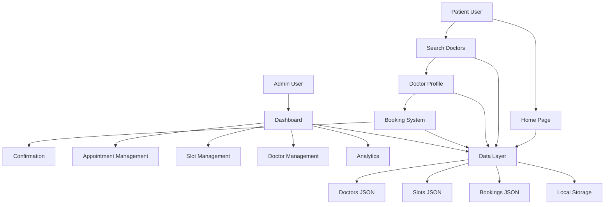

# MediConnect Project Analysis

## Project Overview

MediConnect is a comprehensive healthcare booking platform that enables patients to find and book appointments with doctors, while providing administrative tools for clinic management.

## Current Architecture & Implementation Status

### ✅ **Fully Implemented Features**

#### **Core Pages & Navigation**
- **Home Page** ([`index.html`](index.html:1)) - Landing with hero section, quick search, and features
- **Doctor Search** ([`search.html`](search.html:1)) - Advanced filtering and doctor listings
- **Doctor Profile** ([`doctor.html`](doctor.html:1)) - Detailed doctor info with booking calendar
- **Booking System** ([`booking.html`](booking.html:1)) - Complete patient booking workflow
- **Admin Dashboard** ([`admin.html`](admin.html:1)) - Clinic management interface

#### **Data Management**
- **Doctor Database** ([`data/doctors.json`](data/doctors.json:1)) - 6 doctors across multiple specialties
- **Time Slot Management** ([`data/slots.json`](data/slots.json:1)) - 30+ available appointment slots
- **Booking Records** ([`data/bookings.json`](data/bookings.json:1)) - 10 sample bookings with status tracking

#### **Technical Implementation**
- **Main JavaScript Module** ([`main.js`](main.js:1)) - 430 lines of shared functionality including:
  - Form validation and submission handling
  - Toast notification system
  - Loading state management
  - Local storage utilities
  - Animation controller using Anime.js

#### **Design System**
- **Visual Design Guide** ([`design.md`](design.md:1)) - Complete color palette, typography, and component specs
- **Interaction Design** ([`interaction.md`](interaction.md:1)) - User flows and component behaviors
- **Responsive Design** - Mobile-first approach with bottom navigation

### 🔧 **Technical Stack**
- **Frontend**: HTML5, Tailwind CSS, Vanilla JavaScript
- **Animations**: Anime.js, Typed.js
- **Charts**: ECharts.js (Admin dashboard)
- **Data**: JSON files with localStorage for state management
- **Icons**: Heroicons (SVG-based)

## Key Strengths

1. **Complete User Journey**: End-to-end booking workflow from search to confirmation
2. **Responsive Design**: Mobile-optimized with dedicated mobile navigation
3. **Rich Doctor Profiles**: Comprehensive information with reviews and availability
4. **Advanced Filtering**: Multi-criteria search with real-time filtering
5. **Admin Dashboard**: Comprehensive analytics and management tools
6. **Professional Design**: Healthcare-appropriate color scheme and typography

## Identified Improvement Opportunities

### 🚀 **High Priority Enhancements**

1. **Backend Integration**
   - Replace JSON files with real database
   - Implement user authentication system
   - Add real-time availability updates

2. **Enhanced Features**
   - Patient profile management
   - Appointment reminders (email/SMS)
   - Prescription management system
   - Video consultation integration

3. **Performance Optimizations**
   - Implement service worker for offline functionality
   - Add image optimization and lazy loading
   - Implement code splitting for faster load times

### 🛠 **Technical Improvements**

1. **Code Organization**
   - Modularize JavaScript into separate files
   - Implement proper error handling
   - Add comprehensive testing suite

2. **Accessibility**
   - Improve screen reader compatibility
   - Add keyboard navigation enhancements
   - Ensure WCAG 2.1 AA compliance

3. **Security**
   - Input sanitization and validation
   - Secure localStorage usage
   - Implement CSRF protection

### 📱 **User Experience Enhancements**

1. **Advanced Search**
   - Geolocation-based doctor recommendations
   - Insurance provider filtering
   - Urgent care availability

2. **Patient Features**
   - Health record management
   - Prescription refill requests
   - Appointment history and tracking

## System Architecture

## Current Project Health

**Status**: **Production Ready** - Core functionality is fully implemented and working

**Code Quality**: **Good** - Well-structured with consistent patterns and good documentation

**User Experience**: **Excellent** - Intuitive navigation and professional design

**Scalability**: **Limited** - Current JSON-based data storage suitable for demo but needs database for production

## Next Steps Recommendations

1. **Immediate**: Deploy current version for user testing
2. **Short-term**: Implement user authentication and patient profiles
3. **Medium-term**: Add backend API and real database
4. **Long-term**: Expand to multi-clinic support and advanced features

The MediConnect platform demonstrates a solid foundation for a healthcare booking system with professional design, comprehensive functionality, and excellent user experience.